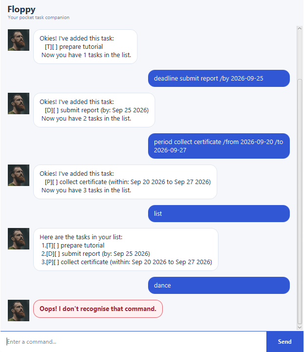

# Floppy User Guide



Floppy is a friendly desktop task manager for people who prefer entering short,
precise commands. It remembers your tasks between sessions and supports todos,
deadlines, events, and tasks that can be completed within a date range.

## Quick start

1. Install Java 25.
2. Download `floppy.jar` from the latest GitHub release.
3. Open a terminal in the folder containing the JAR.
4. Run `java -jar floppy.jar`.
5. Type a command in the field at the bottom and press **Enter** or **Send**.

Dates use the `yyyy-MM-dd` format, for example `2026-09-25`.

## Adding tasks

### Todo

Use a todo for a task without a date.

```text
todo read chapter 6
```

### Deadline

Use a deadline for a task that must be completed by a date.

```text
deadline submit report /by 2026-09-25
```

### Event

Use an event for an activity occurring across a date range.

```text
event orientation camp /from 2026-09-21 /to 2026-09-23
```

### Task to complete within a period

Use a period task when the work may be completed at any time between two
inclusive dates.

```text
period collect certificate /from 2026-09-15 /to 2026-09-25
```

The end date cannot be earlier than the start date.

## Viewing and finding tasks

Show every saved task:

```text
list
```

Find tasks whose descriptions contain a keyword. Matching ignores letter case.

```text
find report
```

## Updating tasks

The task number is the number shown by `list`.

Mark a task as completed:

```text
mark 2
```

Mark a task as incomplete again:

```text
unmark 2
```

Delete a task:

```text
delete 2
```

## Exiting Floppy

```text
bye
```

Floppy disables further input after displaying its farewell. You can also close
the window normally.

## Troubleshooting

- **A command is highlighted in red:** read Floppy's explanation and correct
  the format shown in the message.
- **A date is rejected:** use a real calendar date in `yyyy-MM-dd` format.
- **A task number is rejected:** run `list`, then use one of the displayed
  numbers.
- **A description is rejected:** `|` is reserved by Floppy's data format and
  cannot be used in task descriptions.
- **The application does not start:** confirm `java -version` reports Java 25
  and start the JAR from a terminal to view the error message.

## Credits

The JavaFX FXML structure and original avatar assets were adapted from the
[SE-EDU JavaFX tutorial](https://se-education.org/guides/tutorials/javaFxPart1.html).
